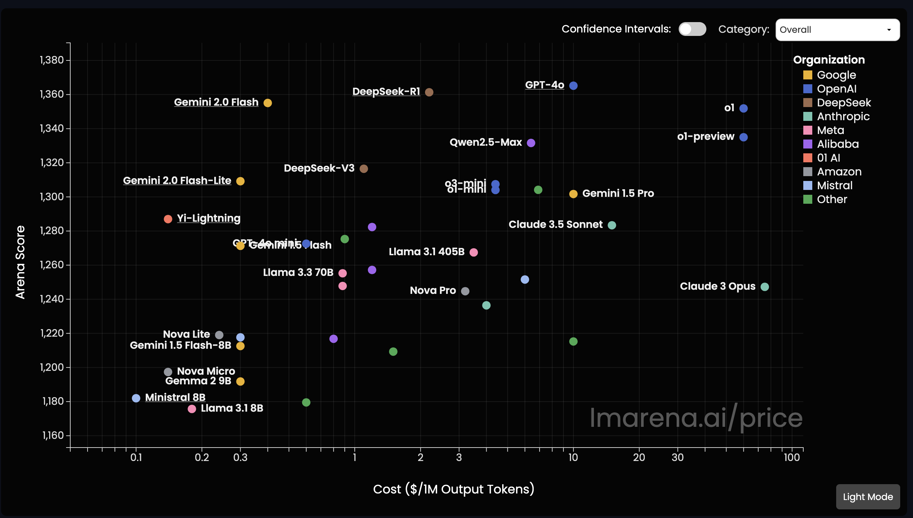

# Using a LLM model via API vs self-hosting

## Date:
2025-02-15

## Status:
Accepted

## Context:
Given the large set of available LLM models, we need to choose whether to self-host a LLM (which requires the usage of an open source LLM) or use a LLM API.
This decision is crucial and impacts development velocity, operational costs, system performance (in terms of feedback provisioning and grading) and scalability.

The most relevant criteria for us are integration complexity, model performance (model "capability"), usage cost and possible context length to process. 
With the fast development (release cycle) of LLM models, as well as the new releases of Reasoning Models, we also want to consider future migration paths(i.e. we are able to switch the LLM provider or even switch from API to self-host or vice versa). 
We need to evaluate open source solutions that can be locally deployed such as DeepSeek R1/V1, Llama or Mistral, or API services from OpenAI's GPT series, Anthropics Cloud or Google's Gemini.

### Criteria and Estimations
- Integration effort: Local LLM deployment requires significant DevOps expertise for model deployment, scaling and maintenance. API integration is straight forward, since this will only require API key handling and request handling.
- Performance: Performance in the LLM context can mean one of several things, we consider latency (how fast a model produces outputs) and the quality of the model output, as most crucial.
TODO: Screenshot Huggignface Leaderboard
    - Latency: Most of the **required LLM computation power** goes into exam grading and feedback provisioning, which can be done in **batch jobs**, since we do not require "instant" grading but guarantee a 7 day feedback provisioning window. Hence, latency is not a relevant criteria when using models for grading. We might want to enable experts to use LLMs in the human-in-the-loop interventions to faster grade or provide better feedback, and for this latency becomes relevant. However, this requires much less computation compared to the batch grading.
    - Quality: State of Q1 2025, the quality of generated outputs by open source models is comparable to closed source models as can be seen on the [Huggingface Leaderboard](https://lmarena.ai/), a well respected and widely used dashboard in the LLM community, to compare the most recent releases and capable models. In terms of quality, both local and API LLMs can provide the required quality for providing feedbacks for exams.
- Scaling: API services provide built-in scaling, so for API usage scaling is solved. For self-hosted usage, we would need to scale the infrastructure horizontally, i.e. in the context of LLMs increase the hardware components required to parallelize and speed up matrix multiplications (GPUs and TPUs). We process mostly batch jobs, where the computational cost is much better predictable and hence easier to scale than an interactive low latency application.
- Usage cost: Local deployment requires a hardware infrastructure upfront cost, but much lower variable costs. API services charge based per-token. . At high volumes ( > millions of tokens per day), local deployments can become significantly more cost-efficient. **Cost estimation**: 
    - A typical essay page contains about 500 words, i.e. we receive about 600-700 tokens (TODO: Source for tokens per word). 
    - The short-answer part of the aptitude exam requires 5-10 pages of natural language text (consisting of question and answer tuples).
    - In addition, we enrich the model input prompt by provide 5 Q&A tuples from already solved exams (that solved the same questions and were graded as "correct" with a good grade) via RAG (TODO: link the other ADR). Hence we have to process between 30-60 pages (i.e. about 20-40k tokens) per exam just for the input prompt. 
    - We want to use reasoning models, which are much less likely to suffer from hallucinations. The inner monologue, also called chain-of-thought, is expected to increase the input token size by a factor of 2-3x. This can be estimated to require about 100-150k tokens for one exam.
    - The output text length, the prompt templates and guardrails are neglectable to the chain-of-thought and RAG usage cost (estimated 5-10k more tokens).
    - In total, we expect to require **100-200k tokens to grade the short-answer part** of an aptitutde exam. Hence, we need to choose a model that supports this context length and also is known to perform well under longer contex lengths (this is not trivial, as the training data for many foundational models contains much shorter "context windows" and hence the models can have difficulties when grading longer context lengths, even though the model providers claim to support larger context windows).
- Context length: API services provide 32k-100k+ context windows and generally provide more flexibility for long-term content, while local LLM models require more careful prompt engineering. Given our cost estimation, we require a model with 100k+ context window lengths.

## Decision:
We decided to use an LLM API that is considered as state-of-the art (using [Huggingface Leaderboard](https://lmarena.ai/)), supports a large context window and is also known to perform well for large context lengths, and is also considered to be rather cheap than the models from OpenAI or Claude 3 Opus (see our cost estimation analysis). 

### Why did we take this decision?
- Using API has lowest integration complexity
- We do not suffer from vendor lock-in when using an API, as we can enrich the models prompt ourself using a local VectorDB and prompt techniques/templates.
- The cost for API usage is feasible and cheaper than having IT experts doing manual grading. Self-hosting becomes cheaper once the company scaled above a certain user threshold (see cost estimation analysis).

## Consequences:
- We do not require DevOps experts that are specialized in building and maintaining LLM GPU/TPU hardware infrastructure
- Using an LLM API endpoint, we have no vendor lock-in and can easily switch the models later, if e.g. a new model is released, or becomes significantly cheaper
- We can always use the most capable model API, which is not given if we would be required to use an open source model due to self hosting
- Once we reach an break-even point, where self-hosting becomes cheaper than our estimated cost for batch processing graded exams, we can still switch to integrate the required hardware infrastructure into our existing systems and hence enable self-hosted models.
