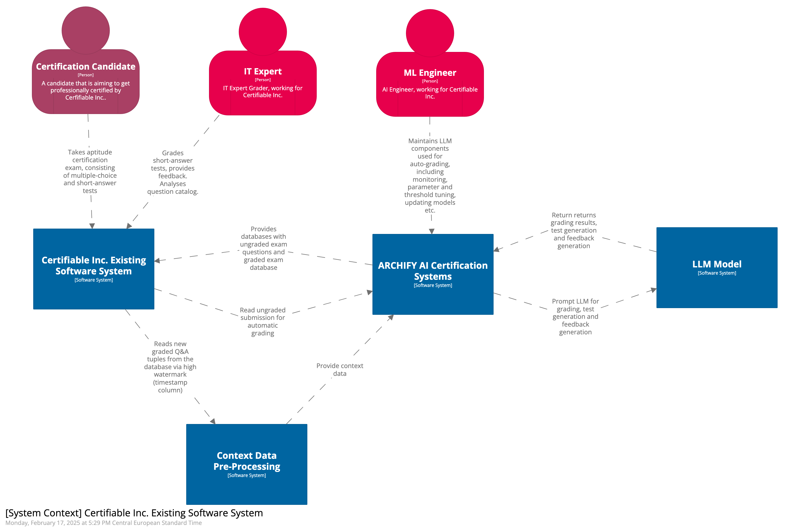
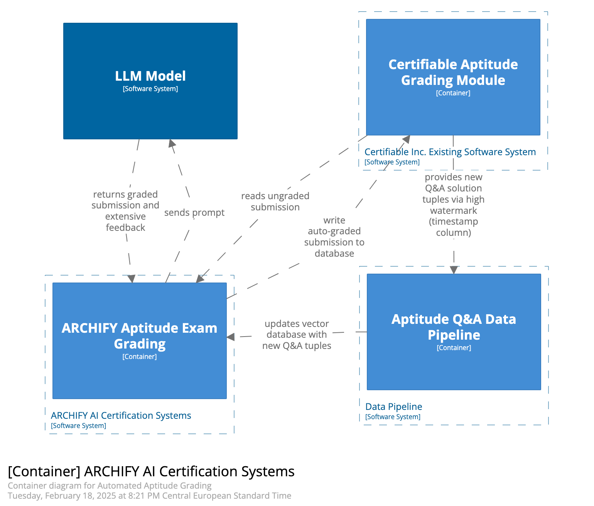

# Architecture & AI | O'Reilly Architectural Kata (Winter 2025)

Our solution for the O'Reilly Architectural Kata (Winter 2025)

- [Team](#team)
- [The Kata](#introduction)
- [Solution Summary](#summary)
- [Requirements](#requirements)
- [Driving Characteristics](#characteristics)
- [Architecture](#architecture)

## Team

(TODO) add pictures

- Manuel Kuchelmeister, [Linkedin](https://www.linkedin.com/in/m-kuchelmeister)
- Joshua Villing, [Linkedin](https://www.linkedin.com/in/joshua-villing-931078130)
- Ignacio de los Rios, [Linkedin](https://www.linkedin.com/in/ignacio-de-los-rios-ruiz-713150162)

## The Kata

Certifiable, Inc. is an accredited leader in the provisioning of software architect certifications. The current certification process requires candidates to pass two different tests: an aptitude test and an architecture case study. The evaluation of these exams and maintenance of the exam database heavily relies on manual work by IT experts. This manual approach has become a bottleneck as the demand for certified architects continues to grow. To address this challenge, Certifiable, Inc. needs to modernize its software architecture by incorporating AI approaches, allowing them to scale their certification process while maintaining high quality standards.

We present ARCHIFY, an innovative software component that seamlessly integrates with the existing software system of Certifiable, Inc. without requiring modifications of other components. ARCHIFY speeds up the certification evaluation process by leveraging a comprehensive existing database of 120,000 previously graded certifications. By enriching a Large Language Model (LLM) with this "historical" data, ARCHIFY generates both automated grading suggestions and detailed candidate feedback.

Our design prioritizes responsible AI integration by maintaining human oversight throughout the evaluation process. Rather than surrendering decision-making of the grading entirely to AI, ARCHIFY integrates IT experts as "human in the loop", ensuring accuracy and accountability in the certification assessment. This balanced approach addresses system bottlenecks, currently hindering scaling, while preserving the critical role of human expertise in the evaluation.

### Key Objectives

We identified the following key objectives:

1. Effective and Innovative AI Integration - Deliver a solution that incorporates generative AI in an **innovative** and **practical** way following industry best-practices
    * Our main contributions for this objective are: 
        * A deep analysis of which AI use cases can be implemented: [ADR-001](/assets/adr/ADR-001-ai-use-cases.md)
        * An interview with an expert for productive RAG systems: [Interview](workshops/01_use_cases/02_ai_interview.md)
        * A thorough analysis for the model decision: [ADR-003](/assets/adr/ADR-003-model.md)
2. Architectural Cohesion and Suitability - Deliver a solution integrates well with the current architecture
    * Our main contributions for this objective are: 
        * An ADR on how we want to integrate the AI within the existing architecture: [ADR-010](/assets/adr/ADR-010-system-integration.md)
3. Accuracy and Reliability of AI Outcomes -  We want that our solution contains mechanisms to maintain the **integrity**, **correctness** and **trustworthiness** of AI-generated results
    * Our main contributions for this objective are:
        * Human-in-the-loop approach: [ADR-002](assets/adr/ADR-002-human-in-the-loop.md)
        * Providing problem-specific context and instructions to the LLM: [ADR-004](assets/adr/ADR-004-provide-context-for-llm.md), [ADR-011](assets/adr/ADR-011-data-aggregation-for-rag.md), [ADR-012](assets/adr/ADR-012-knowhow-base.md)
        * Use input and output guardrails to add an additional layer of security: [ADR-005](assets/adr/ADR-005-aptitude-test-input-guradrails.md), [ADR-007](assets/adr/ADR-007-structured-output.md)

## Solution Summary

We propose to integrate AI within two areas of the Certifiable Inc. System: 

### Automating the grading process

The manual effort in the current process is the main barrier to scalability. 
We address this by automating large parts of the grading process for both aptitude short questions and the architectural case study. 

**Aptitude exam questions** will be automatically graded by an LLM. 
The prompt to the LLM will be enriched with known accepted answers from previous exam. 
The graded exam questions are passed back to the existing Certifiable System where they can be manually reviewed. 
Our System flags which questions most likely need to be reviewed by a human. 
This is done by determining how similar a given answer is to known accepted answers. 

**Architecture exam submission** will be automatically evaluated by an LLM. 
The prompt to the LLM will include the set of evaluation criteria as well as technical knowledge (e.g. books) for the given case study. 
The result of the automatic grading of architecture exam submissions will always be reviewed by a human. 

### Automating exam creation & maintenance

The second largest challenge Certifiable Inc. faces is maintenance of their exam base. 
With our solution we propose to automate parts of the maintenance process. 
AI will provide support for the creation and maintenance of architecture test cases, such that a human expert spends significantly less time. Creating new exams is done using existing knowledge bases and previously taken exams (including case study scenarios).
As with the automated grading process we want to keep the human in the loop. Generated questions and case studies will always be reviewed by a human before they are allowed to be used in exams.

### System Integration

Data needed to automate these use cases will be read directly from the databases of the existing Certifiable Inc. System. 
As there is no requirement for (near) realtime processing of data, this will be done by a polling mechanism within the new system components. 
Any output generated by the new system components will be written directly into the existing Certifiable Inc. Systems databases. 
This was the new review processes can be integrated into the existing solutions for grading exams. 

## Driving Characteristics

* Scalability
    * [ADR-001](/assets/adr/ADR-001-ai-use-cases.md)
* Maintainability
    * [ADR-001](/assets/adr/ADR-001-ai-use-cases.md)
    * [ADR-010](/assets/adr/ADR-010-system-integration.md)
* Data Consistency & Accuracy
    * [ADR-002](/assets/adr/ADR-002-human-in-the-loop.md)
    * [ADR-007](/assets/adr/ADR-007-structured-output.md)

## Architecture

### System Context

The software extension "ARCHIFY" integrates into the existing Certifiable Inc. software system and is visualized through [C4](https://c4model.com/) diagrams. showing how the new components interact with Certifiable Inc.'s existing software system. In the following, the system context diagram is visualized, click on the diagram to see a more detailed component description.

  <a href="./assets/diagrams/C01-SystemContext.md">
      
      
System Context Diagram, describing how ARCHIFY integrates into the existing software system.

  </a>

The full Context diagram with the description of the Actors and Systems can be found [here](/assets/diagrams/C01-SystemContext.md).

### Container diagrams
<table>
  <tr>
    <td align="center">
      <a href="./assets/diagrams/C02-AptitudeContainer.md">
        
        
Container diagram for the Aptitude Exam Grading module.

      </a>
    </td>
    <td align="center">
      <a href="./assets/diagrams/C02-ArchitectureContainer.md">
        
        
Container diagram for the Architecture Exam Grading module.

      </a>
    </td>
    <td align="center">
      <a href="./assets/diagrams/C02-MaintenanceContainer.md">
        
        
Container diagram for the Exam Maintenance Grading module.

      </a>
    </td>
  </tr>
</table>

### Aptitude Exam Automated Grading (C2)

A more detailed description of this diagram can be found [here](/assets/diagrams/C02-AptitudeContainer.md).

### Architecture Case Study Grading (C2)

A more detailed description of this diagram can be found [here](/assets/diagrams/C02-ArchitectureContainer.md).

### Exam & Question Generation (C2)

A more detailed description of this diagram can be found [here](/assets/diagrams/C02-MaintenanceContainer.md).

### Component Diagrams

The component diagrams contain more detailed description of the design of the individual automation use cases: 

* [Aptitude Grading](/assets/diagrams/C03-AptitudeComponents.md)
* [Architecture Case Study Grading](/assets/diagrams/C03-ArchitectureComponents.md)
* [Exam Maintenance](/assets/diagrams/C03-MaintenanceComponents.md)

## Requirements

TODO: define choice of requirements

- Ci (f.ex. [C1](/01-requirements/requirements-and-assumptions.md)) , for constraints
- Ri (f. ex. [R1](/01-requirements/requirements-and-assumptions.md)), for functional requirements
- Qi (f.ex. [Q1](/01-requirements/requirements-and-assumptions.md)), for non-functional requirements
- Ai (f. ex. [A1](/01-requirements/requirements-and-assumptions.md)) , for assumptions

We typically link to the file, but due to markdown limitations, the specific entry can not be referenced in the link.
