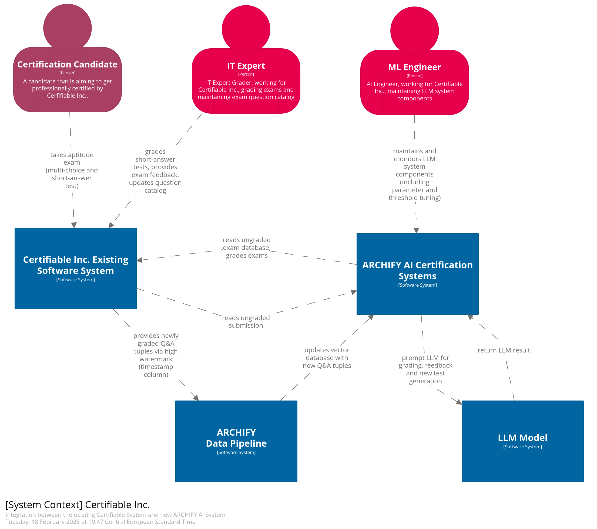

# Architecture & AI | O'Reilly Architectural Kata (Winter 2025)

Our solution for the O'Reilly Architectural Kata (Winter 2025)

- [Team](#team)
- [The Kata](#introduction)
- [Solution Summary](#summary)
- [Requirements](#requirements)
- [Driving Characteristics](#characteristics)
- [Architecture](#architecture)

## Team

(TODO) add pictures

- Manuel Kuchelmeister, [Linkedin](https://www.linkedin.com/in/m-kuchelmeister)
- Joshua Villing, [Linkedin](https://www.linkedin.com/in/joshua-villing-931078130)
- Ignacio de los Rios, [Linkedin](https://www.linkedin.com/in/ignacio-de-los-rios-ruiz-713150162)

## The Kata

Certifiable, Inc. leads in U.S. software certification but must evolve to expand globally. Its reliance on manual processes may hinder scalability, requiring AI integration for efficiency. A targeted redesign of SoftArchCert can help manage demand while maintaining accuracy.

During the katas we created a concept that will help certifiable to scale in a controled way. we were able to identify three use cases that act as a bottleneck when it comes to scaling and focused on these three cases. While we recognize the potential of AI and most precisely, LLMs, we are very aware of the potential risks of using these technologies for automated tasks in the IT sector. Our architecture leverages the potential of AI and aims to mitigate the risks and threads that this technology brings with it.

### Key Objectives

We identified the following key objectives:

1. Effective and Innovative AI Integration - Deliver a solution that incorporates generative AI in an **innovative** and **practical** way following industry best-practices
    * Our main contributions for this objective are:
2. Architectural Cohesion and Suitability - Deliver a solution integrates well with the current architecture
    * Our main contributions for this objective are:
3. Accuracy and Reliability of AI Outcomes -  We want that our solution contains mechanisms to maintain the **integrity**, **correctness** and **trustworthiness** of AI-generated results
    * Our main contributions for this objective are:
        * Human-in-the-loop approach: [ADR-013](assets/adr/ADR-013-prompt-template.md)[ADR-002](assets/adr/ADR-002-human-in-the-loop.md)
        * Providing problem-specific context and instructions to the LLM: [ADR-004](assets/adr/ADR-004-provide-context-for-llm.md)[ADR-011](assets/adr/ADR-011-data-aggregation-for-rag.md)[ADR-012](assets/adr/ADR-012-knowhow-base.md)
        * Use input and output guardrails to add an additional layer of security: [ADR-007](assets/adr/ADR-007-structured-output.md)[ADR-005](assets/adr/ADR-005-aptitude-test-input-guradrails.md)

## Solution Summary

We propose two areas in which to levarage AI. 

### Automating the grading process
    * Aptitude test: Fully automated grading with minimal human review
    * Architecture test: Automated grading and feedback suggestions with more human oversight.

### Automating exam creation & maintenance
    * AI will provide support for the creation and maintenance of architecture test cases, such that a human expert spends significantly less time. Creating new exams is done using existing knowledge bases and previously taken exams (including case study scenarios).

## Driving Characteristics

* Scalability
    * [ADR-001](/assets/adr/ADR-001-ai-use-cases.md)
* Maintainability
    * [ADR-001](/assets/adr/ADR-001-ai-use-cases.md)
* Data Consistency & Accuracy
    * [ADR-002](/assets/adr/ADR-002-human-in-the-loop.md)

## Architecture

The software extension "ARCHIFY" integrates into the existing Certifiable Inc. software system and is visualized through C4 diagrams. showing how the new components interact with Certifiable Inc.'s existing software system. In the following, the system context diagram is visualized, click on the diagram to see a more detailed component description.

  

### System Context

### Aptitude Exam Automated Grading

### Architecture Case Study Grading

### Exam & Question Generation

## Requirements

TODO: define choice of requirements

- Ci (f.ex. [C1](/01-requirements/requirements-and-assumptions.md)) , for constraints
- Ri (f. ex. [R1](/01-requirements/requirements-and-assumptions.md)), for functional requirements
- Qi (f.ex. [Q1](/01-requirements/requirements-and-assumptions.md)), for non-functional requirements
- Ai (f. ex. [A1](/01-requirements/requirements-and-assumptions.md)) , for assumptions

We typically link to the file, but due to markdown limitations, the specific entry can not be referenced in the link.
