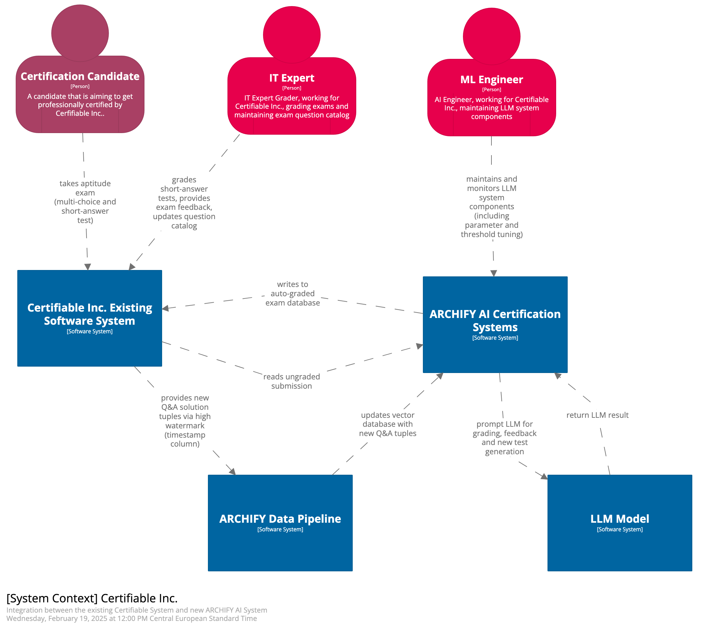
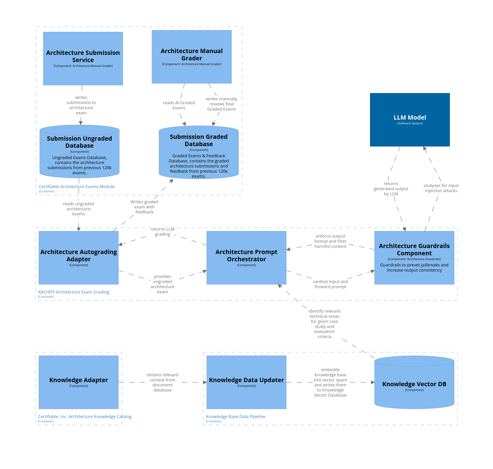

# Architecture & AI | O'Reilly Architectural Kata (Winter 2025)

Our solution for the O'Reilly Architectural Kata (Winter 2025)

- [Team](#team)
- [The Kata](#introduction)
- [Solution Summary](#summary)
- [Requirements](#requirements)
- [Driving Characteristics](#characteristics)
- [Architecture](#architecture)

## Team

We are a team of three senior IT consultants, working on different mandates at [IPT](https://www.ipt.ch) in Zurich, Switzerland.

- Manuel Kuchelmeister, [Linkedin](https://www.linkedin.com/in/m-kuchelmeister)
- Joshua Villing, [Linkedin](https://www.linkedin.com/in/joshua-villing-931078130)
- Ignacio de los Rios, [Linkedin](https://www.linkedin.com/in/ignacio-de-los-rios-ruiz-713150162)

## The Kata

Certifiable, Inc. is an accredited leader in the provisioning of software architect certifications. The current certification process requires candidates to pass two different tests: an aptitude test and an architecture case study. The evaluation of these exams and maintenance of the exam database heavily relies on manual work by IT experts. This manual approach has become a bottleneck as the demand for certified architects continues to grow. To address this challenge, Certifiable, Inc. needs to modernize its software architecture by incorporating AI approaches, allowing them to scale their certification process while maintaining high quality standards.

We present ARCHIFY, an innovative software component that seamlessly integrates with the existing software system of Certifiable, Inc. without requiring modifications of other components. ARCHIFY speeds up the certification evaluation process by leveraging a comprehensive existing database of 120,000 previously graded certifications. By enriching a Large Language Model (LLM) with this "historical" data, ARCHIFY generates both automated grading suggestions and detailed candidate feedback.

Our design prioritizes responsible AI integration by maintaining human oversight throughout the evaluation process. Rather than surrendering decision-making of the grading entirely to AI, ARCHIFY integrates IT experts as "human in the loop", ensuring accuracy and accountability in the certification assessment. This balanced approach addresses system bottlenecks, currently hindering scaling, while preserving the critical role of human expertise in the evaluation.

### Key Objectives

We identified the following key objectives:

1. Effective and Innovative AI Integration - Deliver a solution that incorporates generative AI in an **innovative** and **practical** way following industry best-practices
    * Our main contributions for this objective are: 
        * A deep analysis of which AI use cases can be implemented: [ADR-001](/assets/adr/ADR-001-ai-use-cases.md)
        * An interview with an expert for productive RAG systems: [Interview](workshops/01_use_cases/02_ai_interview.md)
        * A thorough analysis for the model decision: [ADR-003](/assets/adr/ADR-003-model.md)
2. Architectural Cohesion and Suitability - Deliver a solution that integrates well with the current architecture
    * Our main contributions for this objective are: 
        * An ADR on how we want to integrate the AI within the existing architecture: [ADR-010](/assets/adr/ADR-010-system-integration.md)
3. Accuracy and Reliability of AI Outcomes -  We want that our solution contains mechanisms to maintain the **integrity**, **correctness** and **trustworthiness** of AI-generated results
    * Our main contributions for this objective are:
        * Human-in-the-loop approach: [ADR-002](assets/adr/ADR-002-human-in-the-loop.md)
        * Providing problem-specific context and instructions to the LLM: [ADR-004](assets/adr/ADR-004-provide-context-for-llm.md), [ADR-011](assets/adr/ADR-011-data-aggregation-for-rag.md), [ADR-012](assets/adr/ADR-012-knowhow-base.md)
        * Use input and output guardrails to add an additional layer of security: [ADR-005](assets/adr/ADR-005-aptitude-test-input-guradrails.md), [ADR-007](assets/adr/ADR-007-structured-output.md)

## Solution Summary

We propose to integrate AI within two areas of the Certifiable Inc. System: 

### Automating the grading process

The manual effort in the current process is the main barrier to scalability. 
We address this by automating large parts of the grading process for both aptitude short questions and the architectural case study.

**Aptitude exam** questions will be graded by an AI system. We decided to use a state of the art LLM API, with performance, context length and cost as main decision drivers. We propose a solution that decides which exams will be additionally reviewed by a human grader. Additionally, we propose methods to secure our system both against malicious prompt injections and erroneous LLM outputs. Another important factor that we considered is how we will enrich the LLM prompt: for that, we use RAG to enrich LLM prompts with known question-answer tuples from past exams.

**Architecture exam** will be automatically evaluated by an LLM. The prompt to the LLM will include the set of evaluation criteria as well as technical knowledge relevant to the given case study. Which knowledge is relevant is determined with the help a vector database. The result of the automatic grading will always be reviewed by a human.

### Automating exam creation & maintenance

The second largest challenge Certifiable Inc. faces is maintenance of their exam base. 
With our solution we propose to automate parts of the maintenance process. 
AI will provide support for the creation and maintenance of architecture test cases, so human experts spend significantly less time on maintenance. Creating new exams is done using existing knowledge bases and previously taken exams (including case study scenarios).
As with the automated grading process we want to keep the human in the loop. Generated questions and case studies will always be reviewed by a human before they are allowed to be used in exams.

### System Integration

Data needed to automate these use cases will be read directly from the databases of the existing Certifiable Inc. System. 
As there is no requirement for (near) realtime processing of data, this will be done by a polling mechanism within the new system components. 
Any output generated by the new system components will be written directly into the existing Certifiable Inc. Systems databases. 
This way, the new review processes can be integrated into the existing solutions for grading exams. 

## Requirements

In a kick-off workshop, we identified context, made assumptions and formulated requirements that are relevant for our architecture contributions. The results of that workshop is available under [List of requirements and assumptions](./assets/requirements-and-assumptions.md). 

We identified the following context, assumptions and requirements as most relevant for our contributions:
#### Context
- The manual grading process is quite time-intensive - 3 hours for aptitude tests and 8 hours for case studies, showing the significant human effort currently required.
- Experts don't just grade - they're also responsible for analyzing reports and updating test questions, indicating a complex role beyond pure evaluation.
#### Assumptions
- "Reasoning Models" from late 2024 can perform multi-step evaluations and align with human reasoning for grading architecture solutions. This suggests a significant advancement in AI capabilities specifically relevant to architecture evaluation.
- Exam data read from the existing Certifiable, Inc. system is available as clear-text.
- Architectural diagrams are created in DSL, making them machine-readable and processable by LLMs.
#### Requirements
- Grading quality must stay consistent and accurate.
- The one week turnaround for exam evaluations must be kept when demand increases.
- Maintaining the exam base must stay feasible when demand increases.

## Architecture

### Driving Characteristic

* Scalability
    * [ADR-001](/assets/adr/ADR-001-ai-use-cases.md)
* Maintainability
    * [ADR-001](/assets/adr/ADR-001-ai-use-cases.md)
    * [ADR-010](/assets/adr/ADR-010-system-integration.md)
* Data Consistency & Accuracy
    * [ADR-002](/assets/adr/ADR-002-human-in-the-loop.md)
    * [ADR-007](/assets/adr/ADR-007-structured-output.md)

### System Context (C1)

ARCHIFY integrates into the existing Certifiable Inc. software system and is visualized through [C4 diagrams](https://c4model.com/):

  <a href="./assets/diagrams/C01-SystemContext.md">
      
      
System Context Diagram, describing how ARCHIFY integrates into the existing software system.

  </a>

The full context diagram with the description of the Actors and Systems can be found [here](/assets/diagrams/C01-SystemContext.md).

### Container diagrams (C2)

The container diagram describes the high-level interactions of ARCHIFY and Certifiable, Inc. containers.

* [C2 Aptitude Grading](./assets/diagrams/C02-AptitudeContainer.md)
* [C2 Architecture Case Study Grading](./assets/diagrams/C02-ArchitectureContainer.md)
* [C2 Exam Maintenance](./assets/diagrams/C02-MaintenanceContainer.md)

<table>
  <tr>
    <td align="center">
      <a href="./assets/diagrams/C02-AptitudeContainer.md">
        
        
Aptitude Exam Automated Grading (C2)

      </a>
    </td>
    <td align="center">
      <a href="./assets/diagrams/C02-ArchitectureContainer.md">
        
        
Architecture Case Study Grading (C2)

      </a>
    </td>
    <td align="center">
      <a href="./assets/diagrams/C02-MaintenanceContainer.md">
        
        
Exam & Question Generation (C2)

      </a>
    </td>
  </tr>
</table>

### Component Diagrams

The component diagrams contain a more detailed description of the design of the individual automation use cases: 

* [C3 Aptitude Grading](/assets/diagrams/C03-AptitudeComponents.md)
* [C3 Architecture Case Study Grading](/assets/diagrams/C03-ArchitectureComponents.md)
* [C3 Exam Maintenance](/assets/diagrams/C03-MaintenanceComponents.md)

<table>
  <tr>
    <td align="center">
      <a href="./assets/diagrams/C03-AptitudeComponents.md">
        
        
Aptitude Exam Automated Grading (C3)

      </a>
    </td>
    <td align="center">
      <a href="./assets/diagrams/C03-ArchitectureComponents.md">
        
        
Architecture Case Study Grading (C3)

      </a>
    </td>
    <td align="center">
      <a href="./assets/diagrams/C03-MaintenanceComponents.md">
        
        
Exam & Question Generation (C3)

      </a>
    </td>
  </tr>
</table>

## Limitations & Constraints
Our current architecture has the following constraints:

- Even when providing context through previous exams and a knowledge base, LLMs might not be mature enough to grade an architecture case study end-to-end reliably with human expert level.
- Due to the non-deterministic nature of LLMs, exam gradings are inconsistent, even in rather trivial cases.
- Generative Models tend to over-estimate their own grading capabilities.
- The graded exam database and the knowledge base can contain outdated or biased information, which potentially "corrupts" the LLM grading.

