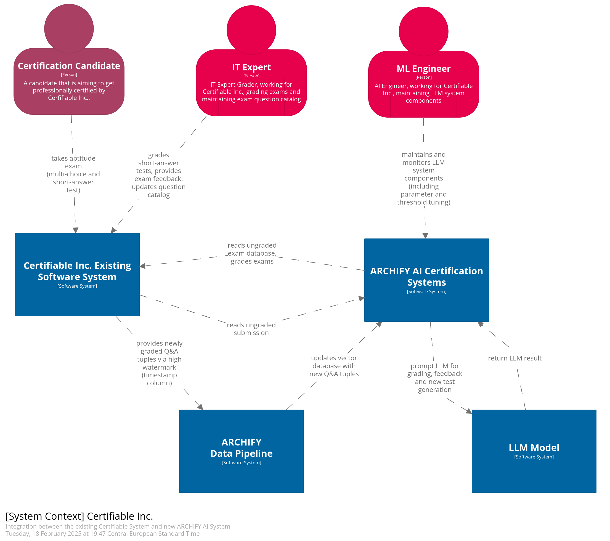

# System Context Diagram

## Software Systems

### Certifiable Inc. Existing Software System 

The exisiting IT systems of Certifiable Inc. This includes the API Gateway, services and corresponding databases for registering candidates, taking and grading exams as well as notifying candidates.

### ARCHIFY AI Certification System

The ARCHIFY AI system components orchestrates the Use Cases that are automated with AI ([ADR-001](/assets/adr/ADR-001-ai-use-cases.md)). 
It integrates the automated use cases into the existing system ([ADR-010](/assets/adr/ADR-010-system-integration.md)). 
It reads ungraded exams existing Certifiable System, enriches them with relevant context and writes grade suggestions and feedback to the grade and feedback databases ([ADR-011](/assets/adr/ADR-011-data-aggregation-for-rag.md)).

### ARCHIFY Data Pipeline: 

The database that provides context for the LLM model is updated regularly with this system module.

### LLM Model 

ARCHIFY AI Certification handles prompt engineering, prompt context provisioning and guardrails, hence the LLM model can be any LLM API or a self-hosted model, that fulfils the criteria discussed in [ADR-003](../adr/ADR-003-model-choice.md)

## Actors

The following provides an overview of the actors in the system, excluding the administrator, as the tasks for the admin are not affected with the LLM integration changes.

| **Actor**                | **Description**                                                                       |
|--------------------------|---------------------------------------------------------------------------------------|
| Certification Candidate  | A certification candidate who uses the platform to be come a certified IT architect.  |
| IT Expert                | IT professional who is grading the candidates exam and providing feedback.            |
| ML Engineer              | Expert in LLM integration, maintaining the LLM systems and monitoring performance.    |

