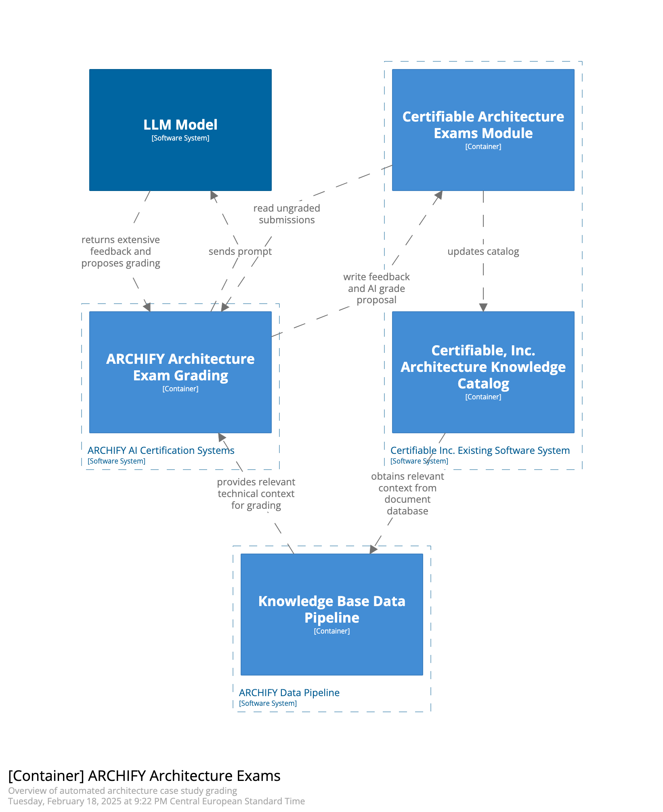

# Automated Architecture Case Study Grading (C2)

## Containers

### Certifiable Architecture Exams Module

This container represents a part of the existing Certifiable Inc. system. 
It contains the parts that are relevant for the current manual grading process. 
This most notably includes databases for graded and ungraded exam questsions 
as well as existing infrastructure for manual grading. 

### Certifiable Knowledge Base

This container represents a part of the existing Certifiable Inc. system. 
The knowledge base contains technical information such as books and research papers. 
This knowledge is the base for evaluating and creating case studies. 
See also [A11](/assets/adr/ADR-011-data-aggregation-for-rag.md)

### Archify Architecture Exam Grading

This container represents the new components that will automate the grading process. 
Exams that need to be graded are read from the existing certifiable system. 
The graded exams are then sent back to the existing certifiable system. 

### Knowledge Base Data Pipeline

This container is responsible for pre-processing data that is required to augment LLM promts. 
In the architecture grading use case this includes processing the contents of the knowledge base. 
This data is embedding them into a vector database.
This vector database can be used to identify the relevant technical context for a given case study. 

### LLM Model

This container represents the actual large language model which is promted by the Archify System. (See [ADR-003](/assets/adr/ADR-003-model.md))

