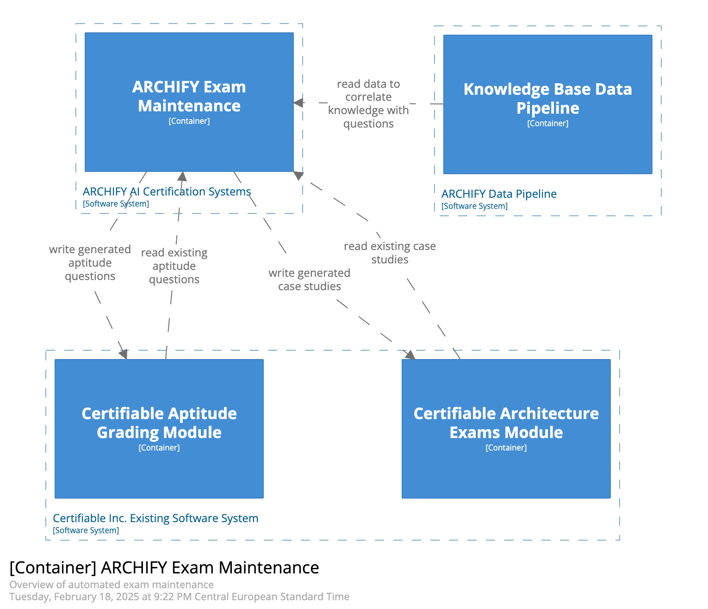

# Automated Exam Maintenance (C3)

## Containers

### Certifiable Architecture Exams Module

This container represents a part of the existing Certifiable Inc. system. 
It contains the parts that are relevant for the current manual grading process. 
This most notably includes databases for graded and ungraded exam questsions 
as well as existing infrastructure for manual grading. 

### Certifiable Aptitude Grading Module

This container represents a part the existing Certifiable Inc. system. 
It contains the parts that are relevant for the current manual grading process. 
This most notably includes databases for graded and ungraded exam questsions 
as well as existing infrastructure for manual grading. 

### Certifiable Knowledge Base

This container represents a part of the existing Certifiable Inc. system. 
The knowledge base contains technical information such as books and research papers. 
This knowledge is the base for evaluating and creating case studies  
(See also [A11](/assets/requirements-and-assumptions.md)).

### Archify Exam Maintenance

This container represents the new components that will automate the exam creation process ([ADR-001](/assets/adr/ADR-001-ai-use-cases.md)). 
Using the contents of the knowledge base vector database areas for new question can be identified.
New created exam questions and case studies are written back to the existing Certifiable System ([ADR-010](/assets/adr/ADR-010-system-integration.md)).  

### Knowledge Base Data Pipeline

This container is responsible for pre-processing data that is required to augment LLM promts. 
In the architecture grading use case this includes processing the contents of the knowledge base. 
This data is embedding them into a vector database ([ADR-012](/assets/adr/ADR-012-knowhow-base.md)).
This vector database can be used to identify areas where new questions are needed. 

### LLM Model

See [C01-SystemContext](./C01-SystemContext.md)

