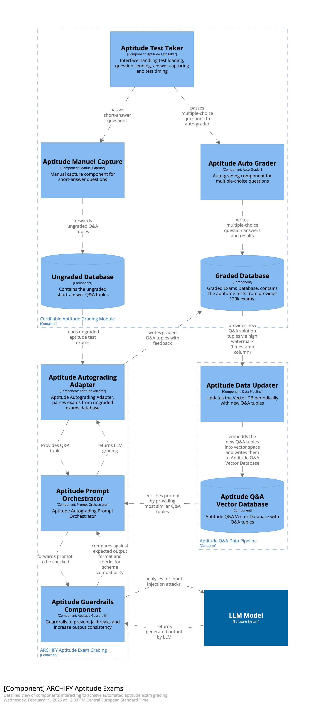

# Automated Aptitude Grading (C3)

## Components

### Aptitude Test Taker

This component is part the existing Certifiable Inc. system. 
The component is responsible for executing the exams provides the ungraded database. 

### Aptitude Manual Capture

This component is part the existing Certifiable Inc. system. 
The component receives the short question parts of the aptitude exam and writes them into the ungraded database.

### Aptitude Auto Grader

This component is part the existing Certifiable Inc. system. 
The component receives the multiple choice parts of aptitude questions applies automated grading writes the graded questions to the graded database. 

### Ungraded Database

This component is part the existing Certifiable Inc. system. 
This database contains the ungraded submissions for aptitude exam short questions.

### Graded Database

This component is part the existing Certifiable Inc. system. 
This database contains the graded submissions for aptitude exam short questions.

### Aptitude Autograding Adapter

This component is a gateway between the new Archify AI system and the existing Certifiable Inc. System.
It regularly reads ungrded exam questions from the ungraded database. 
The result of automatic grading is written into the graded database ([ADR-010](/assets/adr/ADR-010-system-integration.md)). 
The result for every question contains the Q&A pair, the assessment of the LLM and a similarity score ([ADR-008](/assets/adr/ADR-008-aptitude-test-split-for-grading.md)). 
The score indicates similarity to known answers and is used to decide whether human review of the grading is needed.
The actual propmting of the LLM is delegated to the Aptitude PromtOrchestrator.

### Aptitude Promt Orchestrator

The promt orchestrator uses the Aptitude Q&A Vector Database to identify similar question answers, that can be used as context when prompting the LLM ([ADR-004](/assets/adr/ADR-004-provide-context-for-llm.md)). 
It then constructs a promt to grade a single question using a template [ADR-013](/assets/adr/ADR-013-prompt-template.md). 
The constructed prompt is then forwarded to the guard rails component. 

### Aptitude Guard Rails Component

The guard rails component is responsible for sanitizing input and output for the LLM. 
Promts received from the orchestrator are sanitized to prevent prompt injection ([ADR-009](/assets/adr/ADR-009-aptitude-ai-output-verification.md)). 
Output from the LLM is checked for harmful content. 
Additionally it is verified, that the received output has to correct structured format ([ADR-007](/assets/adr/ADR-007-structured-output.md)).

### Aptitude Data Updater

The aptitude data updater is responsible for pre-processing context data that can be used to augment LLM promts. 
It regularly reads Q&A data from the graded database
and embeds the data into vector space ([ADR-011](/assets/adr/ADR-011-data-aggregation-for-rag.md). 
The created vectors can be used to identify similarity between given answers from new question and known answers. 

### Aptitude Q&A Vector Database

Contains Q&A data used to evaluate similarity between existing question asnwers and new exam submissions ([ADR-004](/assets/adr/ADR-004-provide-context-for-llm.md)).

### LLM Model 

See [C01-SystemContext](./C01-SystemContext.md)