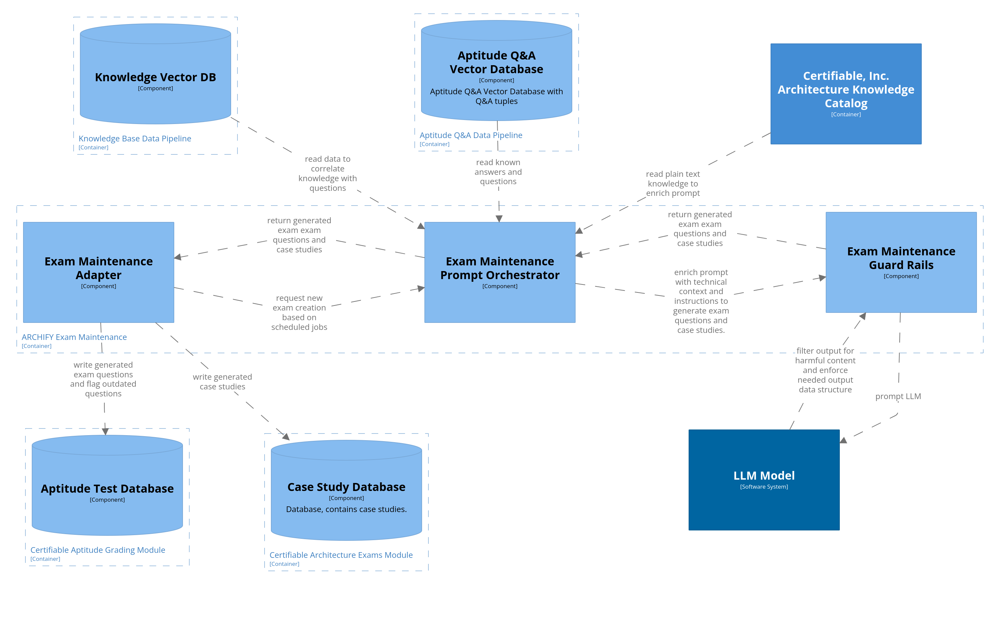

# Automated Exam Maintenance (C3)

### Aptitude Test Database

This component is part the existing Certifiable Inc. system. 
The database contains a catalog of questions that are used in the aptitude exam.

### Case Study Database

This component is part the existing Certifiable Inc. system. 
The database contains a catalog of case studies that are used in the architecture exam.

### Exam Maintenance Adapter

This component is responsible for scheduling new maintenance tasks regularly.
Maintenance tasks include generating new questions for aptitude exams and case studies for architectural exams. 
The maintenance adapter requests new questions and case studies from the promt orchestrator. 
The results are written to the aptitude test and case study databases respectively. 

### Exam Maintenance Promt Orchestrator

The promt orchestrator uses the Knowledge Vector Database to identify areas where to few questions or case studies are available.
It then uses the relevant technical information as context to prompt the LLM to generate new exams.  
All promts are construted with a template [ADR-013](/assets/adr/ADR-013-prompt-template.md) and sent to the LLM via the guard rails component. 

### Exam Maintenance Guard Rails

The guard rails component is responsible for sanitizing input and output for the LLM. 
Promts received from the orchestrator are sanitized to prevent prompt injection. 
Output from the LLM is checked for harmful content. 
Additionally it is verified, that the received output has to correct structured format.

### Aptitude Q&A Vector Database

See [C03-ArchitectureComponent](./C03-ArchitectureComponents.md)

### Knowledge Vector Database

See [C03-ArchitectureComponent](./C03-ArchitectureComponents.md)

### LLM Model 

See [C01-SystemContext](./C01-SystemContext.md)