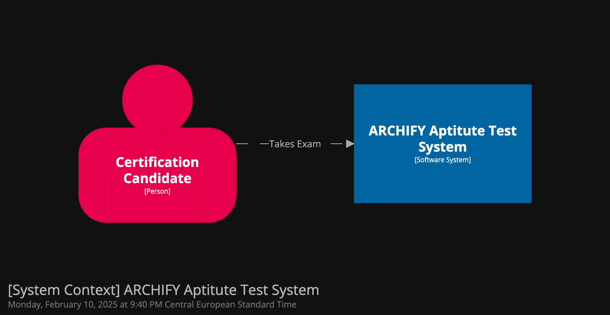

Our software architecture contributions are modelled using the [C4 model](https://c4model.com/) approach.
This enables us to represent our ideas and contributions on different levels of abstractions.
For this we use the tool [Structurizr](https://structurizr.com/), which provides functionality to save diagrams as code, enabling us to easily collaborate and reuse architecture elements across multiple diagrams.

# Installation and Usage

To work on the architecture model, use your favorite container runtime and substitue `PATH` with the location where the `workspace.dsl` diagram is located:
```
docker pull structurizr/lite
docker run -it --rm -p 8080:8080 -v PATH:/usr/local/structurizr structurizr/lite
```

# Context diagram

