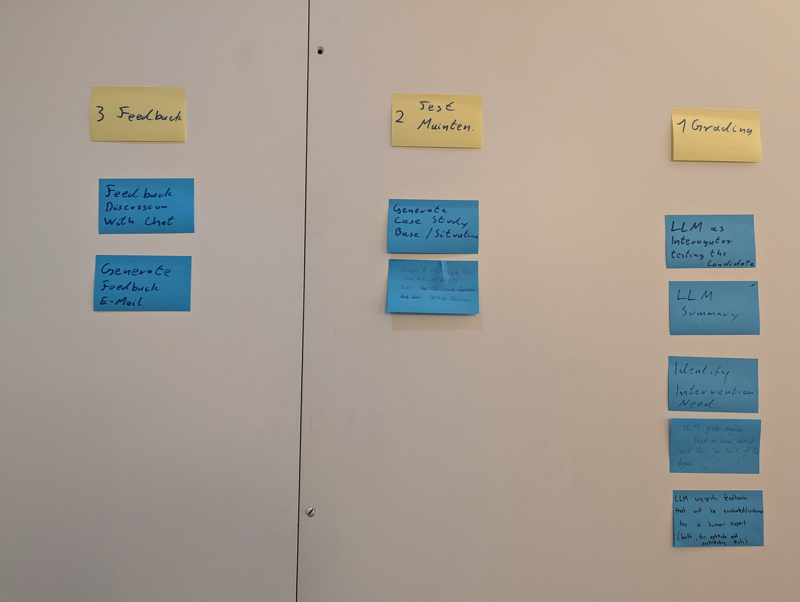

# Workshop 1 - Opportunities Kick Off

This workshop was organized as a kick of to the Architectural Kata. Our goal in this workshop was to form a common understanding of the current constraints and challanges Certifiable faces.

Based on this we identified and prioritised opportunities to address the scaling concerns with the usage of AI. These opportunities will be the basis for our solution. 

## Agenda

1. Identify Constraints & Assumptions
2. Brainstorm optimization opportunities 
3. Group & Prioritize opportunities
4. Identify possible uses of AI for the most important groups

## Summary 

We identified 3 areas in which we want to explore the use of AI:

1. Grading Performance
    * Grading an be (partially) automated with AI
    * Some tests could be replaced with a Chat AI performing and grading the test. 

2. Test Maintenance
    * AI can be used to create new questions for the aptitude test
    * AI can be used to create new drafts for case studies for the architecture test

3. Feedback / Results
    * AI can be used to automate the feedback given to the user based on the grading result. 

 

----

 

# Detailled Meeting notes

## Part 1 - Constrains and Assumptions

Context, requirements and assumptions are documented [here](../../assets/requirements-and-assumptions.md).

## Part 2 - Opportunities & Challanges

The following groups of opportunities were identified:

#### Group 1 - Grading Performance

The main bottle neck are the manual grading parts. Optimizing this process should be the first priority as it is vital to Certifiables business. 

* (Partial) automation of aptitude test grading
* (Partial) automation of architecture test grading
* Automation support to handle short term peaks in useage

#### Group 2 - Test Maintenance

With a growing user base more tests variations are needed to ensure fairness. If all users receive the exact same few tests, the content of these tests will become well known. 

* Geneartion of test questions for aptitude test 
* Geneartion of scenarios for architectural test
* Identify & integrate new technological developments and integrat in test questions

#### Group 3 - Feedback / Results

Each user receives detailled Feedback on their test result. This process involves manual steps that could be automated. 

* Automation of entering & consolodating grading results
* Automation of feedback sent to the user

#### Group 4 - Cheat Detection / Prevention

With more users Cheat Detection and Prevention becomes more relevant, as more answers will leak. It is important to address this issue. However, good test maintenance can helt mitigate this problem and makes the issue less pressing.  

#### Group 5 - Grading Quality

The workload for Experts grading the exams will grow. It is vital to ensure that this does not lead to a degradation in quality. However, the grading process will need to change to address the expected growth. The quality concerns need to be considered within the new process. Dedicated measures for quality ensurance are less important. 

#### Group 6 - Analytics

With a growing user base certifiable will need to adapt their analytics efforts. Manualy analysing results and statistics will no longer be feasible. However, this is not an immediate concern, as it has a more delayed impact on the business processes. It can well be addressed, once the process for dealing with the expected growth is defined. 

## Part 3 - Identify Possible Use Cases

The following possible uses for AI were identified. 

#### Group 1 - Grading Performance

* Use AI to add interactive elements to the testing process. 
    * Chat bot asking the user additional questions to their solution. 
    * Chat bot performing the aptitude test entirely
    * Grading could be integrated into this chat. Either completely or as a suggestion that needs manual review. 

* Use AI to suggest feedback for test submissions
    * A (aptitude or architeture) test is automatically graded by AI
    * This feedback is manually reviewd by an expert 
    * The expert can accept / change the feedback before finalizing the result

* Use AI to fully grade test submissions
  
* Use AI to summarize submitted solutions
    * Providing a summary could improve the grading process. 
    * It could summarize parts with clearly wrong solutions. 
    * It could summarize the interesting parts that do not conform to the "standard" solution. 

* Use AI to classify test results
    * Is a detailled manual review needed?

#### Group 2 - Test Maintenance

* Generate the basis for new case studies with AI

* Genearte new questions for aptitude test
    * This will need integration with a suitable knowledge base. 

#### Group 3 - Feedback / Results

* Use AI to enable the user to interact with the test results
  * A chat bot could be used to give the user additional context and answer questions

* Use AI to generate and send a feedback email based on the test results
    

## Next Steps

* Homework: Draft suggestions for implementing concrete use cases
* Homework: Identify what Architectural Decisions need to be done
* Workshop 2 on 13.02.2025
    * Present and refine suggestions in the team
    * Discuss identified ADR Candidates
    

## Images & Boards

### Brainstorming

### Use Cases

